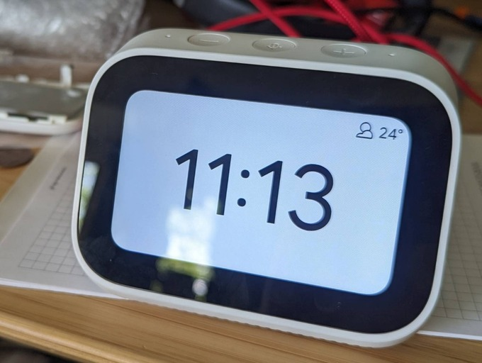

# xiaomi-x04g-research

This repository summarizes my quick research of Xiaomi X04G Mi Smart Clock
running Android Things (10). Running stock firmware this device is fairly
limited only supporting basic alarm clock and Google Assistant features without
any debugging/extensibility available.



Devices' bootloader can be unlocked using
[`mtkclient`](https://github.com/bkerler/mtkclient) tool and a `boot.img`
patched with slightly customized [Magisk
install](https://github.com/topjohnwu/Magisk) can be used to enable ADB shell
and run usual Android apps.

Usual Magisk installer app can't be used since we can't actually install and
run any application on the device in the first place. I am no Android expert,
but I have a suspicion a "proper" working recovery built for this platform
could make installing magisk much simpler (ie. just load Magisk.apk as an
update.zip), however this would require me delving into whole Android build
ecosystem and I didn't really feel like it. It is probably fairly backwards. I
hope this research might come in hand for someone willing to experiment on
this platform further, and could lead to a proper recovery accepting unsigned
payloads sometime in the future.

This should probably work in a fairly similar manner on other Android Things
devices running on Mediatek SoCs.

**No warranty guaranteed, do this at your own risk.**

Mind you - after initial eMMC dump, **if I understand it correctly**, it should
be pretty difficult to brick the device, since VOL+ can be used to force a
device into bootrom mode and `mtkclient` can be used to bring back full eMMC
storage contents to stock.

## Guide
*...to dump, unlock the bootloader and get working ADB/root on stock firmware*

0. Hold VOL+ button when asked by mtkclient to connect the device.
1. Dump all partitions using mtkclient: `sudo python mtkclient/mtk rl dump`
   **Back this up...**
2. Unlock bootloader using mtkclient: `sudo python mtkclient/mtk da seccfg unlock`
3. Patch up boot.img: `bash ./magisk-install.sh dump/boot.img`
4. Reflash patched boot.img: `python mtkclient/mtk w boot /tmp/extract/new-boot.img`
5. Power cycle - device should expose an unauthorized ADB shell and expose a remote
   shell on 1337 TCP port accessible on local network (this can be disabled by
   modifying `init.adb.rc`).

## Hardware

* Mediatek MT8167A
* Kioxia THGBMNG5D1LBAIL 4GB eMMC
* 2x Samsung K4B4G1646E-BYMA 4Gb RAM (=> 1GB)

### Main PCB Layout
* TP30 = UART TX (1.8v logic levels, ttyS0 - uart0@11005000)
* TP29 = UART RX (?)
    * **Note:** UART0 is disabled by default in dtb - this needs to be rebuilt
      and cmdline specified in dtb needs to have `console=tty0` removed to
      actually get anything on there.

* CON6212 = LCD/Touch
* CON6213 = ALSPS - EM3071x
* CON6214 = volume/mute buttons

## Behaviour

### Normal bootup
* Mediatek MT65xx Preloader (0e8d:2000) ACM device whows up after 3 seconds of
  pwer up. Disappears after 2 seconds.
* 12 seconds later Xiaomi X04G (0e8d:2008) MTP device shows up


* VOL+ on bootup
    * 0e8d:0003 ACM device shows up for 5 seconds (bootrom)
    * Then usual bootup goes on (MT65xx preloader included)

* VOL+ & VOL- on bootup
    * 0e8d:0003, 0e8d:2000, "No command screen"
    * Pressing Mute & VOL+ simultaneously gets us to Android Recovery - this is kinda wonky, maybe I sometimes need to let the device boot up completely for this to work? No idea.

### Android recovery
```
Xiaomi/mico_x04g/micro_x04g
10/QP1A.190711.020/1.7.5
user/release-keys
```

* Enter fastboot gets us to fastbootd - exposes 18d1:4ee0 fastboot device
	* Doesn't accept/boot unsigned payloads
* Reboot to bootloader reboots to a fastboot-capable "=> FASTBOOT mode..."
  screen (0e8d:201c)
	* `fastboot reboot recovery` gets us back to "No command" screen (but usual recovery key combo doesn't seem to work?)
    * Doesn't accept/boot unsigned payloads

* https://forum.xda-developers.com/t/mi-smart-clock-how-to-enter-recovery-mode-fastbootd.4586969/
* https://github.com/MaxCaiLC/twrp_xiaomi_lx04_device_tree
* https://forum.xda-developers.com/t/xiaomi-mi-smart-clock.4442335/

### Firmware/eMMC dump

```sh
sudo python mtk rl dump
```

* userdata.img is encrypted using file-based encryption
* system/vendor/product data is stored in `super.bin` -> "super partition" - use
  lpdump and lpunpack to extract it

### seccfg unlock

bootloader can be unlocked:

```sh
sudo python mtk da seccfg unlock
```

recovery.bin/boot.bin repacked using magiskboot tool seems to work fine
(including file modifications, without changes to vbmeta) - android_universal-built
images don't seem to boot for some reason.

### Magisk boot

`magiskboot` and friends can be extracted from magisk apk -
`PLATFORM/lib/libmagiskboot.so`

* https://github.com/topjohnwu/Magisk/blob/master/scripts/boot_patch.sh

`init.adb.rc` contains everything needed to enable unauthenticated adb - insert
this into `overlay.d` directory in `boot.img` (probably - by patching
`boot_patch.sh`)

* https://android.googlesource.com/platform/system/core/+/master/init/README.md
* https://topjohnwu.github.io/Magisk/guides.html

### Recovery patching experiment

Patched recovery sometimes starts hanging on black screen with ro.debuggable=1
(without working usb!)
